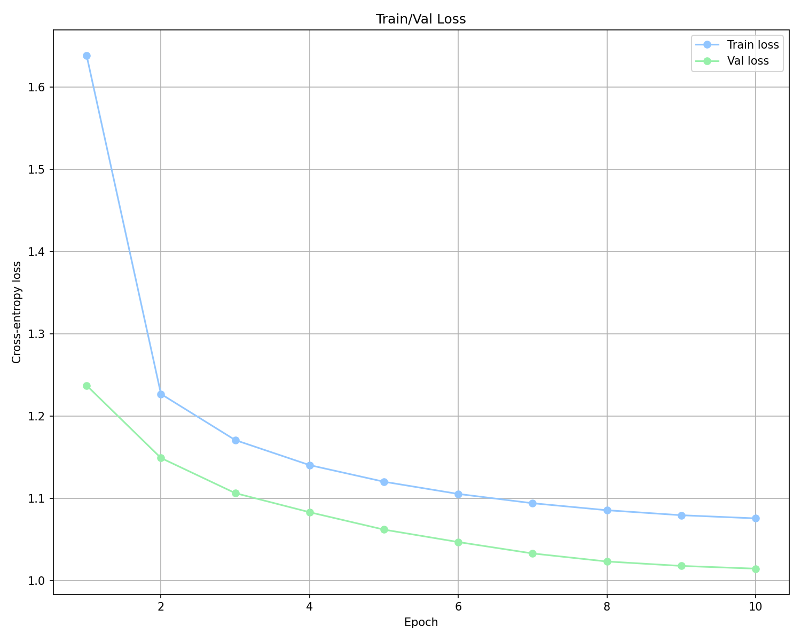
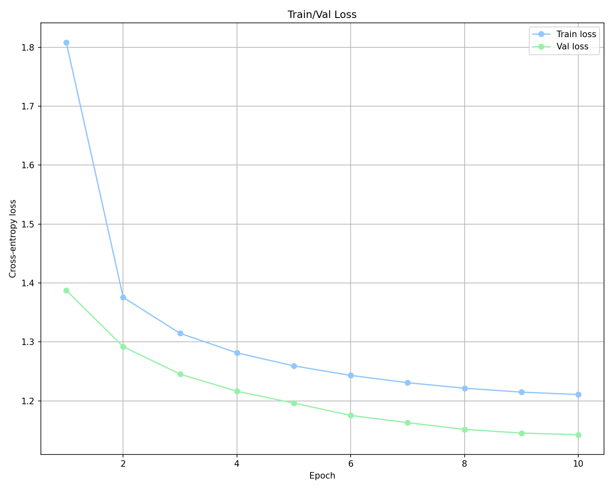
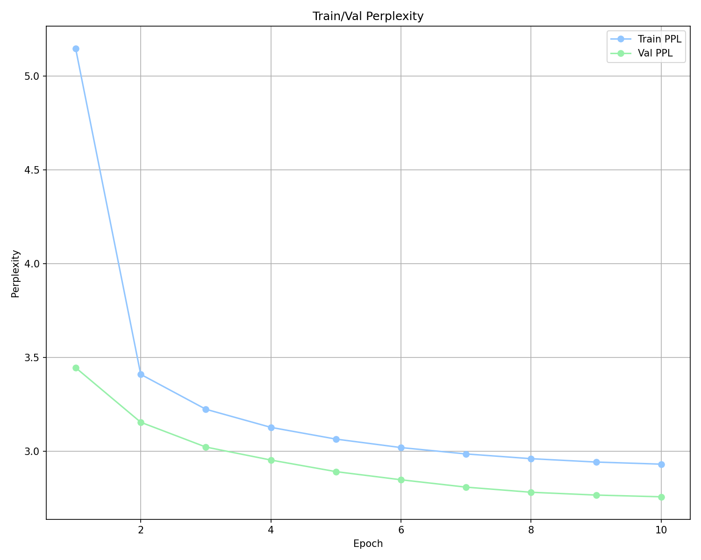
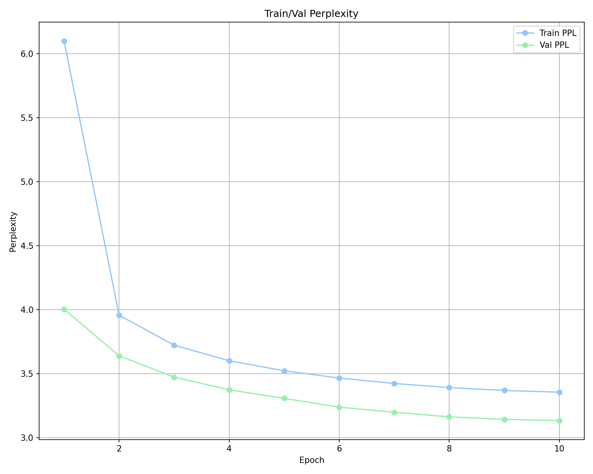

# Recipe GPT

[](https://github.com/angelikizoi/Recipe-Next-Token-Generator/actions/workflows/tests.yml)
[](LICENSE)

A GPT-2-style decoder-only Transformer, trained from scratch to generate cooking recipes from a short list of ingredients. Includes a custom byte-pair-encoding tokenizer built from first principles, a HuggingFace-compatible tokenizer, and full MLflow experiment tracking.

Trained on the [Recipe 2M+ dataset](https://www.kaggle.com/datasets/wilmerarltstrmberg/recipe-dataset-over-2m) (2M+ recipes).

## Pipeline

The project is organized as a linear ML pipeline, one package per stage:

```
config/       Typed dataclass configs (model hyperparameters, data paths, special tokens)
data/         Raw CSV -> flat text corpus, offset index, PyTorch Dataset/Sampler/collate
tokenizer/    Two interchangeable tokenizers: a from-scratch BPE trainer, and a HuggingFace BPE trainer
model/        The Transformer_Decoder itself (causal self-attention, tied embeddings, GPT-2-style init)
training/     Training/eval loop, MLflow logging, loss & perplexity curves
inference/    Top-k sampling generation, loadable from any MLflow run
results/      Loss/perplexity curves, sample generations, and metrics from the latest training run
```

Each stage is a runnable module:

```bash
uv sync                                   # install dependencies

python -m data.preprocess                 # CSV -> data/recipe.txt + offset index
python -m tokenizer.hugging_face_tokenizer # trains the HuggingFace BPE tokenizer
python -m tokenizer.custom_tokenizer_train # (optional) trains the from-scratch BPE tokenizer

mlflow server --host 127.0.0.1 --port 5000 &  # tracking server the scripts below expect
python -m training.train                  # trains the model, writes results/

python -m inference.generate --prompt "chicken, rice, curry"

pytest tests/                             # unit tests (no dataset required)
```

Model and data hyperparameters live in [config/model_config.py](config/model_config.py) and [config/data_config.py](config/data_config.py) — nothing is hardcoded in the pipeline scripts themselves.

## Model

* Decoder-only Transformer, GPT-2-style (causal self-attention, pre-LN blocks, tied input/output embeddings, GPT-2 init with depth-scaled residual projections)
* Configurable depth/width via `ModelConfig` — the tracked run below used 8 layers, `d_model=256`, 8 heads (~6.8M params)
* Trained with AdamW, gradient clipping, dropout, bf16 autocast, and a nanoGPT-style linear-warmup / cosine-decay learning-rate schedule
* Runs are seeded end-to-end (NumPy + Torch) and the best epoch by validation loss is restored before reporting results
* A length-bucketed batch sampler (`SentenceLenSampler`) groups similarly-sized recipes together per batch to minimize padding waste

## Tokenizer

Two BPE tokenizers are supported, sharing the same special-token scheme (`<|TITLE|>`, `<|INGREDIENTS|>`, `<|DIRECTIONS|>`, `<|EOS|>`, `<|PAD|>`):

* **Custom** ([tokenizer/custom_tokenizer_train.py](tokenizer/custom_tokenizer_train.py)) — BPE merge-learning implemented from scratch, parallelized across CPU cores with a Count-Min Sketch for approximate pair-frequency counting over the full 2M+ recipe corpus without materializing exact counts in memory.
* **HuggingFace** ([tokenizer/hugging_face_tokenizer.py](tokenizer/hugging_face_tokenizer.py)) — the same vocabulary scheme trained via `tokenizers.BpeTrainer`, used as the default at training/inference time for speed.

## Experiment tracking

Every training run logs to MLflow: hyperparameters, per-epoch train/val loss & perplexity, gradient norms, model checkpoints per epoch, and the generated result artifacts (loss/perplexity curves, sample generations). See `training/train.py`.

## Results

8 layers, `d_model=256`, 8 heads (~6.8M params), vocab 512, 10 epochs over 2M+ recipes
on a single RTX 5060 Ti. Both tokenizers train under an identical configuration and seed.

| tokenizer | merges | val loss | val perplexity | tokens/byte | **bits/byte** |
|---|---|---|---|---|---|
| custom BPE | 251 | 1.014 | 2.76 | 0.426 | **0.623** |
| HuggingFace BPE | 407 | 1.143 | 3.13 | 0.378 | **0.623** |

**Read the last column, not the perplexity.** Per-token perplexity is not comparable
across tokenizers: the custom BPE fits 251 merges into the 512-token budget against
HuggingFace's 407, so it emits finer-grained tokens that are each individually easier
to predict. That accounts for essentially all of its apparent 12% perplexity advantage.
Normalised to bits-per-byte — compression of the same underlying text — the two are
indistinguishable, within 0.2%. **A BPE implemented from first principles compresses
this corpus as well as a production library's implementation**, which is the result
this project was built to test.

Validation loss decreased monotonically for both runs, every epoch, with no instability
spikes; both were still improving at epoch 10, so these numbers are a floor rather than
a converged ceiling.

| | custom | HuggingFace |
|---|---|---|
| loss |  |  |
| perplexity |  |  |

Generation runs until the model emits `<|EOS|>` rather than to a fixed token budget, so
sample length is the model's decision — across the twelve samples it ranges from 142 to
1807 characters. Each run writes both a clean file and a `_raw` one with the structure
markers left visible, which is the useful view when checking whether the model has
actually learned the ingredients/directions boundary. Full set in [results/](results/):

> **flour, sugar, butter, eggs**, flour, lemon flavoring, baking powder, salt
> `<|DIRECTIONS|>` Mix together. Pour into greased 9x13 pan. Bake 30 min at 350 degrees.
> Serve with whipped cream or ice cream. `<|EOS|>`

> **tomato, basil, mozzarella**, tomatoes, olives, basil, Parmesan, grated cheese, black
> pepper `<|DIRECTIONS|>` Prepare your mayo according to the directions on the package,
> then place in bowl. Add the mozzarella, and the black pepper. […]

At 6.8M parameters the model reliably produces the ingredients → directions structure and
locally fluent culinary prose, and short recipes are frequently coherent end to end. It
still drifts over longer generations — repeating ingredients, losing track of what is
already in the pan, and inventing occasional non-words.

One artefact worth naming: generations sometimes contain the literal six-character
sequence `\u00b0` instead of `°`. That is faithful reproduction, not a bug here — the upstream Kaggle CSV
was serialised from JSON without unescaping, so roughly every baking recipe in the
training data contains it.

### Effect of the fixes

The same configuration before the initialisation and residual-path bugs described below
were fixed:

| | custom | HuggingFace |
|---|---|---|
| before | val 2.29 / ppl 9.84, diverged at epoch 5 | val 2.00 / ppl 7.39, oscillating |
| after | **val 1.01 / ppl 2.76**, monotonic | **val 1.14 / ppl 3.13**, monotonic |

Perplexity improved 3.6× and 2.4× respectively, and the training instability that
prompted the investigation disappeared entirely — it was an architecture bug, not a
learning-rate problem.

The later special-token fixes barely moved the aggregate loss (custom 1.016 → 1.014,
HuggingFace 1.132 → 1.143) but they were what made the comparison trustworthy: before
them, each run was handicapped differently, so the two bits-per-byte figures were not
measuring the same thing.

## Engineering notes

Building this from scratch surfaced a number of bugs that are easy to miss because
nothing crashes — the model simply trains worse. They are documented here because
finding them was most of the work:

* **Positional embeddings initialised 28× too large.** `_init_weights` applied the
  GPT-2 residual-scaling factor but never the underlying `normal_(std=0.02)` init, so
  every module silently kept PyTorch's default. `nn.Embedding` defaults to N(0, 1),
  which left `wpe` at std 1.0 against a tied `wte` at 0.036 — at initialisation the
  positional signal drowned out token identity ~28:1. The tell: initial loss should
  equal `ln(vocab_size)` for a correctly initialised LM. It now does (6.29 vs 6.24).
* **The pre-LN block normalised the residual stream itself** (`x = self.l1(x)`) rather
  than only the branch input (`x = x + attn(self.l1(x))`). This re-normalises away
  each block's contribution, severing the identity path that makes deep transformers
  trainable. Measured across 8 blocks, the residual norm was pinned flat at ~16.4
  instead of growing.
* **The HuggingFace tokenizer deadlocked the DataLoader.** Its Rust thread pool does
  not survive `fork`, so worker processes intermittently hung forever on the first
  batch (~50% of runs). Fixed with `multiprocessing_context="spawn"`, which also
  required replacing a `lambda` collate function with `functools.partial` to keep it
  picklable.
* **Train/val splits were not reproducible.** Only `torch.manual_seed` was set;
  `np.random.permutation` drove both the split and the batch shuffling, so every run
  silently trained on different data — making runs incomparable.
* **Only the final epoch's weights were ever used.** Training logged a checkpoint per
  epoch but always reported the last one, even when validation loss had clearly
  bottomed out earlier. Best-checkpoint selection is now tracked and restored.
* **`targets.view(-1)` crashed on any non-contiguous target tensor** — latent, because
  the dataset happened to build targets as fresh tensors. Caught by a unit test.
* **The two tokenizers assign special tokens different ids, and the code assumed one
  layout.** The custom scheme puts them at the top of the vocabulary (507–511),
  HuggingFace at the bottom (0–4), but `get_pad_idx` returned the custom value for
  both. Padding the HuggingFace runs with 511 — an ordinary word, `' serving'` — meant
  every genuine occurrence was masked out of attention and dropped from the loss via
  `ignore_index`. Pad is now resolved against the tokenizer itself.
* **The HuggingFace tokenizer had no `<|PAD|>` token at all**, and retraining it to add
  one surfaced a second problem: `limit_alphabet` was unset, and the full corpus
  contains ~628 distinct characters — more than the entire 512-token budget, leaving
  zero room for merges. The original artefact had been trained on a smaller corpus and
  silently depended on it having only ~95.
* **A 252nd merge overran the vocabulary budget.** `merges.json` held ids 256–507 while
  the config declared 251 merges, so merge 507 (`' cho'`) shared an id with
  `<|TITLE|>` — every recipe's title marker was the same token as the `cho` in
  *chocolate*. The arithmetic settles it: 256 base + 251 merges + 5 special = 512.
* **`decode` silently swallowed anything outside the merge table.** `vocab.get(id, b"")`
  meant the structure markers simply vanished from generated output, which is what hid
  the two bugs above. It now renders them, with `skip_special_tokens` to opt out.
* **Generation ran to a fixed 124 tokens** and stopped mid-word regardless of whether
  the model had finished, which made the samples look far worse than the model was. It
  now runs until `<|EOS|>`, with the context window as a safety net.

## Roadmap

* Train past 10 epochs — validation loss was still falling for both runs when training stopped
* Learning-rate and regularisation sweep, now that the architecture bugs are no longer the bottleneck
* Further scaling of the Transformer and of the tokenizer vocabulary (512 is small; the
  bits-per-byte comparison should be repeated at a larger vocab)
* A small web UI (Streamlit) for interactive recipe generation

---

*Built as a from-scratch NLP project: tokenizer, model, training loop, and experiment tracking all implemented without relying on a pre-built GPT implementation.*
